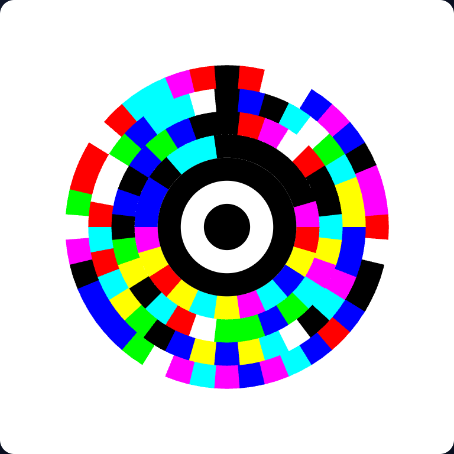
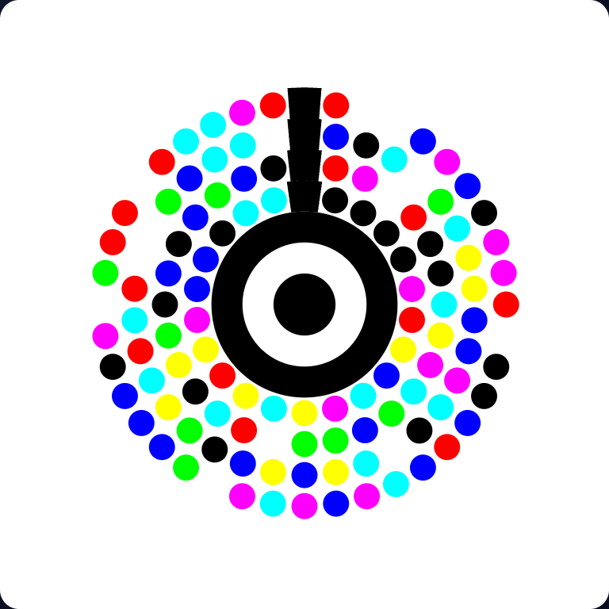
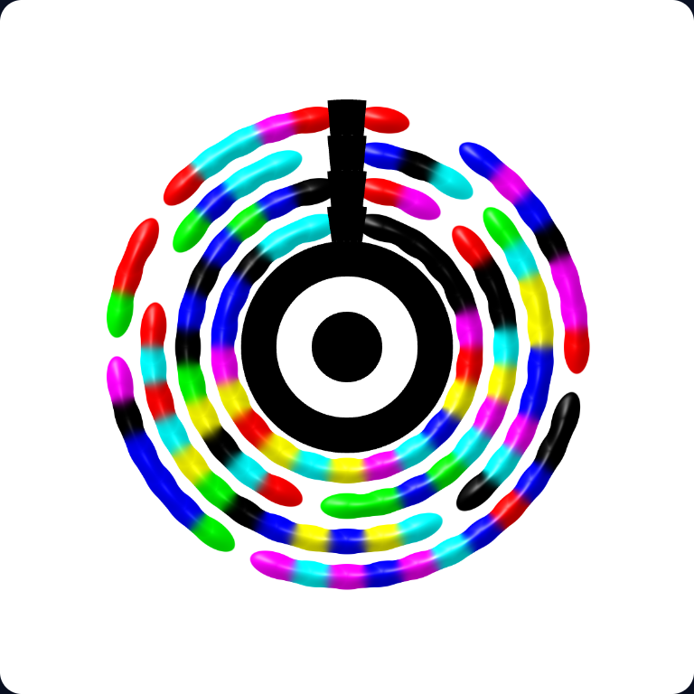

# IRIS


> A radial, self-clocking, multiscale optical code — the successor experiment to QR.

> 🧪 **Beta.** IRIS is an active experiment under heavy development. The symbol format and
> the library API may still change between versions — don't depend on it for anything
> permanent yet. **More language implementations and further decoder improvements are on
> the way** — see the [Roadmap](#roadmap). Feedback and issues are very welcome.

**IRIS** is **not** a square matrix. It localizes on a central **pupil** (bullseye),
samples data on concentric **rings** of self-clocked **segments**, and protects the
payload with **Reed–Solomon** error correction. Capacity grows outward: add rings, never
change the center. See [`AGENTS.md`](./AGENTS.md) for the full specification.

This is an **open-source (MIT)**, **zero-dependency**, plain-JavaScript reference
implementation. No framework, no build step — just the utility to **write** and **read**
IRIS codes.

> 📷 **Try it live:** [quick-hacks.me/#/tools/iris](https://quick-hacks.me/#/tools/iris) —
> generate codes in four styles and scan them with your phone camera, all in the browser.

Two profiles:

- **v2 color (default)** — dense cells, **8-color palette = 3 bits/cell** (JAB-Code-style),
  no per-cell clock tax. Capacity grows outward and **beats QR v40** (>2,953 bytes).
- **v1 mono (`--mono`)** — black & white, **self-clocking** ticks per cell. Lower capacity
  but maximally robust to radial scratches; printer/fax-safe.

## Robustness Lab

The decoder doesn't just read clean renders — it recovers the payload through brutal,
**combined** distortion: arbitrary rotation, scale, perspective tilt, blur, salt-and-pepper
noise and scratches, all at once. These are real screenshots from the in-browser
[Robustness Lab](#website) (`web/`), each fully decoded in well under
a fifth of a second:

| Perspective + odd rotation | Perspective + blur + 11% noise |
| :---: | :---: |
|  |  |
| `persp 0.30 · rot −44°` → ✓ ~90 ms | `scale 0.98× · persp 0.20 · blur 2.2px · noise 11%` → ✓ ~65 ms |

| Rotation + 4 scratches | Everything at once |
| :---: | :---: |
|  |  |
| `rot 130° · 4 scratches` → ✓ ~40 ms | `rot −84° · scale 0.85× · persp 0.25 · blur 1.4px · noise 8% · 2 scratches` → ✓ ~34 ms |

> Drag the sliders yourself — open `web/index.html` (see [below](#website)).

### Cell styles

Same data, four looks — pick from a dropdown in the generator. Only the *data cells*
change; the pupil and the orientation ray stay solid (they're the decoder's fiducials),
so every style decodes equally well:

| Slices | Dots | Blobs |
| :---: | :---: | :---: |
|  |  |  |
| annular sectors — max ink, most robust | crisp circles | glossy **metaballs** (PixiJS / WebGL) |

The fourth style, **Wheel** (`src/wheel-render.js`), blends each cell's colour into its
angular neighbours at the seams so the disc reads as a smooth, detailed colour wheel —
cell centres stay pure (a plateau in the blend), so it still decodes, clean and robust.

**Blobs** are rendered by a small **PixiJS** WebGL shader ([`src/pixi-render.js`](./src/pixi-render.js)):
each cell is an anisotropic metaball that merges *along* its ring into gooey liquid bands
(colours blending at the necks) but is radially confined so **levels never blend**. Lighting
comes from the analytic field gradient — seamless across joints — and the cell cores stay
pure, so even the metaballs decode. SVG handles slices/dots; PixiJS handles blobs.

### RGB markers — faster, safer camera scans

Opt-in fiducial upgrade for real-camera pipelines: `encode(text, { markers: true })` adds
three coloured dots (R, G, B) in the **outer quiet zone**, arranged in a Y around the disc.
Because the quiet zone carries no data they cost **zero capacity** and touch no cell — a
marker code has the *exact same payload* as a plain one, and every decoder still reads it.
What they buy:

- **Point correspondences** — pupil + 3 non-collinear dots → a direct perspective
  **homography** (`decodeColorMarkers`, `src/markers.js`), skipping the geometry search.
- **Colour references** — known pure R/G/B (+ black pupil, white zone) for calibration.

All four styles paint them, so a "Scan markers" toggle in a generator UI is a pure win
for anything that will be read by a phone camera.

## Install / run

Requires Node ≥ 18. No `npm install` needed (no dependencies).

```sh
# Color (default): vector + decodable raster
node bin/iris.js encode "hello iris" -o hello.svg
node bin/iris.js encode "hello iris" -o hello.ppm
node bin/iris.js decode hello.ppm        # -> hello iris

# Mono (black & white, self-clocking)
node bin/iris.js encode "hello iris" -o hello.pgm --mono
node bin/iris.js decode hello.pgm        # -> hello iris

# `decode` isn't limited to clean renders: if the fast path fails it falls back
# to the robust decoder, so rotated / tilted / badly-lit captures work too.
```

### Capacity

Capacity grows outward — the encoder adds rings (`K`) until the payload fits, so small
inputs stay small. ECC is **adaptive**: a small payload leaves spare room in the symbol,
which is spent on extra Reed–Solomon parity (up to ~70%), so short codes are far more
scratch-resilient; large payloads fall back to 30% parity to preserve capacity.

| Payload      | Rings (K) | Cells  | Parity | ~Capacity |
| ------------ | --------- | ------ | ------ | --------- |
| short text   | 4         | ~124   | ~70%   | small, max ECC |
| paragraph    | 12        | ~678   | 30–50% | ~120–170 B |
| 3 KB blob    | 64        | ~14076 | 30%    | ~3,690 B  |

The 3 KB case clears **QR v40's 2,953-byte** ceiling. See the
[capacity research notes](#capacity--research) below for how this was derived.

## Website

A simple generator lives in [`web/`](./web) — type text, get a code, download SVG/PNG.
It imports the **same** `src/` modules directly (browser-native ES modules, Tailwind via
CDN), so there is **no build step**.

It also includes a **Robustness Lab**: distort the generated code (rotation, scale,
perspective, blur, noise, scratches — or hit **🎲 Randomize**) and watch the robust
decoder recover the center, scale and rotation, then rebuild the payload via Reed–Solomon.
A live ✓/✗ badge shows whether reconstruction succeeded and how long it took.

A second page, `web/detect.html`, is the **scene-detection harness** for the two-stage
photo pipeline: a tiny CNN (`web/models/iris-detector.onnx`, ~32 KB, via onnxruntime-web)
**finds the code anywhere in a cluttered frame** — it predicts the pupil-centre keypoint
plus a disc segmentation mask, the ellipse is fitted from the mask, a polar scan
(`web/ray-refine.js`) recovers the rotation, and the crop is handed to the proven
geometric decoder. Everything the model learns from is synthetic with **exact computed
labels**: the [`tools/`](./tools) pipeline (`gen-dataset.js`, `distort.js`, `scene.js` +
the PyTorch trainer `train_detector.py`) reuses the real encoder and a known warp, so no
hand annotation is ever needed — see [`tools/README.md`](./tools/README.md).

```sh
# serve the repository ROOT (so /web can reach /src), then open /web/
python3 -m http.server 8765
# -> http://localhost:8765/web/
```

To host it, deploy the **repository root** as the site and point users at `/web/`
(GitHub Pages, Netlify, Vercel, Cloudflare Pages all work — set the publish directory to
the repo root, not `web/`, because the page imports `../src`).

## Library API

Designed to be dropped into another project — **encoder, decoder and render engine are
each importable on their own.** Subpath exports (`package.json#exports`):

```js
// Core: encode, decoders, SVG/raster renderers — everything but the WebGL engine.
import {
  encode, decode,            // high-level (color by default; { mono: true } for v1)
  encodeColor, decodeColor,  // v2 color profile
  decodeColorRobust,         // real-world decoder: rotation/perspective/lighting/scratch/noise
  decodeColorMarkers,        // fast homography decode via the RGB quiet-zone markers
  renderColorSVG,            // Symbol -> SVG string (slices | dots | blobs)
  renderColorRaster,         // Symbol -> RGB grid
  renderWheelGrid,           // Symbol -> blended "colour wheel" RGB grid
  PALETTE, MARKERS,
} from "iris-code";

const { svg, grid, symbol } = encode("hello iris", { markers: true }); // markers: camera-friendly
console.log(decode(grid).text);                          // "hello iris"
console.log(decodeColorRobust(photoGrid, { budgetMs: 800 }).text); // distorted capture
console.log(decodeColorMarkers(photoGrid)?.text);        // marker fast path (null on miss)
```

```js
// Render engine (browser/WebGL): the metaball "blobs" renderer.
import { renderBlobCanvas, pixiAvailable } from "iris-code/pixi";
import * as PIXI from "pixi.js"; // or load PIXI via a <script> CDN global

const canvas = renderBlobCanvas(encodeColor("hello iris"), { PIXI });
document.body.append(canvas); // ready-to-display HTMLCanvasElement
```

`renderBlobCanvas` takes the `PIXI` instance (or falls back to a global `PIXI`), so IRIS
stays **zero-dependency** — pixi.js is the consumer's choice. It returns `null` off the
browser, so you can fall back to `renderColorSVG(sym, { style: "blobs" })`.

The reference web app (`web/app.js`, `web/lab.js`) is itself just these imports plus DOM
wiring — copy it as a starting point. Also exported: mono (`encodeToSymbol`, `renderSVG`,
`renderRaster`, `decodeRaster`), raster I/O (`gridToPGM`/`pgmToGrid`, `gridToPPM`/`ppmToGrid`),
geometry helpers (`segCounts`, `capacityBits`, `imageSizePx`, `markerFrontal`) and the
homography toolkit (`fitHomography`, `decodeViaHomography`) for wiring an external
detector (e.g. the ONNX localizer) straight into the decoder. Granular subpaths
`iris-code/color`, `iris-code/robust` and `iris-code/wheel` are available too.

## How it works (short version)

| Pillar          | IRIS's answer                                                        |
| --------------- | ------------------------------------------------------------------- |
| Localization    | central **pupil** (bullseye), found in clutter by its QR-finder-style **1:1:2:1:1 scanline signature**; optional ONNX localizer |
| Registration    | full-radius **registration ray** + **ellipse fit** + projective disk offset; optional **RGB markers** → direct homography |
| Sampling        | concentric **rings** of angular **segments**, each **self-marked**   |
| Error correction| **Reed–Solomon** over GF(256) in **interleaved blocks** (≤255 B each), adaptive 30–70% parity |

Each segment carries its own start **tick** (leading 30%, always inked) so the decoder
re-syncs at every cell — this is what makes IRIS strong against radial scratches. The
trailing 70% is the 1-bit **data cell**.

## Layout

```
src/
  params.js      geometry + ring schedules (N_k, image size), marker geometry
  rs.js          Reed–Solomon over GF(256)
  blocks.js      interleaved RS block structure (≤255 B blocks) + adaptive parity
  bits.js        bit packing + CRC-16
  frame.js       payload frame (length + CRC-16), shared by every profile
  encode.js      mono: text -> Symbol
  render-svg.js  mono: Symbol -> SVG
  decode.js      mono: grid -> text
  color.js       v2 color: 3-bit cells, palette, encode/render/decode
  robust.js      robust decode: photometric calibration, center/scale/rotation/
                 perspective recovery, scratch erasures, then sample + RS
  markers.js     optional RGB quiet-zone markers: homography-based decode
  wheel-render.js decorative blended "colour wheel" raster (still decodable)
  pixi-render.js render engine: PixiJS/WebGL metaball "blobs" (iris-code/pixi)
  raster.js      Symbol -> grid; PGM (mono) + PPM (color) I/O
  index.js       public API
bin/iris.js      CLI (encode/decode; decode falls back to the robust decoder)
web/             zero-build generator + Robustness Lab + scene-detection harness
                 (detect.html + models/iris-detector.onnx + ray-refine.js)
tools/           synthetic-data pipeline for the ONNX localizer: gen-dataset.js,
                 distort.js (exact-label warps), scene.js, train_detector.py
test/            node:test round-trip, color, RS blocks, markers, lighting, robustness
```

## Tests & linting

```sh
node --test        # no install needed — the library itself has zero deps
npm run lint       # ESLint (dev-only tool; npm install first)
npm run lint:fix
```

The ~60 tests cover RS error correction (incl. erasures), the interleaved block layout
(burst spreading, erasure routing, large-symbol damage recovery), round-trip property
tests, PGM/PPM serialization, unicode, capacity (beats QR v40), marker geometry + the
marker decode path, lighting (dim, colour casts, shadow gradients, low-contrast mono),
and the full robustness suite (rotation, scale, perspective, noise, scratches — combined).
The library keeps **zero runtime dependencies**; ESLint and friends are
`devDependencies` only.

## Capacity & research

The original mono profile stored ~16–35 bytes because each cell was large (4u arc × 3u
radial = **12 u²**) and 30% of every cell was an always-inked clock tick — at the same
print resolution that's ~12× less dense than a QR module (1 u²) before the clock tax.

v2 closes the gap with three compounding levers drawn from the literature:

- **Smaller cells** (2u arc × 2u radial) → more cells per unit area.
- **No per-cell clock** → recovers the 30% tax (trades some scratch-robustness; use
  `--mono` when you need it back).
- **8-color cells = 3 bits/cell** — the JAB-Code / High-Capacity-Color-Barcode idea
  (ISO/IEC 23634): ~3× the bits of black/white.

Selected references that informed this:

- **QR baseline** — ISO/IEC 18004:2024; v40 = 2,953 bytes binary.
  ([denso](https://www.qrcode.com/en/about/version.html))
- **JAB Code** — Fraunhofer SIT, ISO/IEC 23634:2022; 8 colors, ~3× density.
  ([wikipedia](https://en.wikipedia.org/wiki/JAB_Code) ·
  [github](https://github.com/jabcode/jabcode))
- **Secure & Recoverable RGB-Colored 2D Barcodes** — MDPI Electronics, 2026 (color +
  learned decoder). ([mdpi](https://www.mdpi.com/2079-9292/15/9/1855))
- **DL barcode localization/decoding** — Nature Sci. Reports, 2025.
  ([nature](https://www.nature.com/articles/s41598-025-29720-w))
- **U-Net restoration of damaged QR** — CMES, 2025.
  ([techscience](https://www.techscience.com/CMES/v143n3/62816/html))
- **HiQ high-capacity color QR** — arXiv 1704.06447 (color layering).
- **Multilevel 2D bar codes** — grayscale gives log₂(a²+1) bits/cell.
  ([researchgate](https://www.researchgate.net/publication/221011168))
- **Compression before encoding** — gzip ~+52%; shared-dictionary zstd/brotli ~88–90% on
  small payloads (Chrome 130, Oct 2024).
  ([ieee](https://ieeexplore.ieee.org/document/8710429) ·
  [debugbear](https://www.debugbear.com/blog/shared-compression-dictionaries))

Still on the roadmap: a **compression layer** (mode detection + shared dictionary) so the
stored bytes go further, and **grayscale** as a no-color middle ground.

## Status & scope

Focused on the **clean-render round trip** (AGENTS.md Track-1):

- ✅ color (v2, 3 bits/cell) and mono (v1, self-clocking) encode → SVG / raster → decode,
  with RS error correction; capacity grows outward and beats QR v40.
- ✅ **robust color decode** (`src/robust.js`): recovers center, scale, **any rotation**,
  and **perspective**, and rebuilds **scratched** regions. Tested across all rotations
  0–355° (incl. −84°) with anti-aliasing, rotation+scale+translation, noise, perspective
  up to a steep tilt, perspective+rotation, and multiple thick scratches.
  - **Localization in clutter** — a camera frame is never a code on a white field, so
    besides the whole-image estimate the decoder searches for the pupil the way QR
    readers find their finder patterns: a scanline crossing the bullseye reads
    dark/white/dark/white/dark in ratio **1:1:2:1:1**; hits are verified vertically,
    vote in clusters, and the disc radius comes from a 16-ray walk to the mandatory
    quiet zone. An off-center code on a desk, on a dark background, or rotated inside
    a busy scene decodes in ~150–450 ms.
  - **Rotation** — log-polar / Fourier–Mellin principle (Reddy & Chatterji): a rotation is
    a shift along the angle axis. A full-radius **registration ray** (segment 0 of every
    ring) is the fiducial; chance black-cell alignments can mimic it, so the decoder tries
    each candidate angle and lets **RS + CRC be the arbiter**.
    [Reddy–Chatterji](http://www.liralab.it/teaching/SINA_10/slides-current/fourier-mellin-paper.pdf) ·
    [1D POC rotation](https://link.springer.com/chapter/10.1007/978-3-540-74260-9_19)
  - **Perspective** — the image of a circle is an **ellipse** (AGENTS.md §3 step 3). We fit
    the outer boundary for the affine part and add a **Klein (projective) disk offset** for
    the non-linear foreshortening — together a full homography of the disk. A *conformal*
    Blaschke map can't model a real camera (foreshortening keeps straight chords straight,
    which conformal maps don't); the projective offset is **seeded directly from the bullseye
    core** (its image, displaced from the ellipse centre, *is* the foreshortening), then
    rotation is recovered per offset by a fine snap sweep ranked on **ray darkness**, with
    RS + CRC the arbiter. Decodes **every rotation** to ~0.35 keystone, and composes with
    blur, scale and noise; only extreme grazing angles still fail (single-conic limit).
  - **Scratches** — damaged cells (long near-white streaks, distinct from isolated white
    data cells) are detected and decoded as **Reed–Solomon erasures**, which cost half the
    parity of unknown errors — so the decoder reconstructs what's hidden behind the
    scratch, like a human reading around it. Even a scratch **over the registration ray**
    decodes: when the ray is destroyed, rotation falls back to a brute-force sweep
    arbitrated by RS+CRC.
  - **Adaptive ECC** — short payloads spend their spare symbol space on parity (up to
    ~70%), so even **two scratches at an odd angle** recover (and fast, because high parity
    means decode succeeds in the early phase instead of falling through to slow fallbacks).
  - **Interleaved RS blocks** — RS over GF(256) is only valid up to 255-byte codewords, so
    large symbols (K ≥ 16) split into independent blocks with their bytes interleaved
    (as QR does): a localized burst of damage spreads evenly across blocks instead of
    overwhelming one (`src/blocks.js`, shared by every decoder).
  - **Lighting** — two-stage photometric calibration before any pixel is classified:
    a tile-based **illumination field** flattens spatially varying light (a shadow
    falling across the print), then a per-channel levels stretch (black/white points
    from the image's own percentiles) undoes dim lighting and colour casts — so a warm
    ~half-brightness capture, or one half-covered by a shadow, decodes like a clean
    render. The mono decoder binarizes with **Otsu's threshold** for the same reason.
  - **Noise** — the palette-index map is **mode-filtered** (3×3 majority), so salt-and-pepper
    noise — never the local majority — is overwritten by the surrounding cell colour. Heavy
    noise survives even combined with blur and perspective.
  - **Speed** — per-pixel palette/clean/white masks are precomputed once; the offset is
    **seeded from the projected pupil centre** (not blind grid search) and a clean-cell
    fail-fast skips Reed–Solomon on wrong geometries. Typical cases — including
    perspective + rotation + blur + noise — decode in **~10–200 ms**.
- ✅ **RGB quiet-zone markers** (`src/markers.js`): opt-in, zero-capacity fiducials giving
  a direct perspective homography (`decodeColorMarkers`) + colour references — the fast
  path for camera scanners. Painted by every renderer; validated on clean/mild captures,
  heavy-warp robustness is a work in progress.
- ✅ zero-build Tailwind web generator **+ Robustness Lab**.
- 🧪 **scene detection** (experimental): a ~32 KB ONNX localizer + synthetic-data
  training pipeline (`tools/`, `web/detect.html`) to find codes in cluttered frames and
  seed the geometric decoder — the missing "stage 1" for arbitrary-background photos.

## Roadmap

IRIS is beta and moving fast. On the near-term list:

- 🚧 **More language implementations / ports** beyond this JavaScript reference.
- 🚧 **Real-photo capture** — lens distortion and specular highlights (geometric
  rectification, dim light, colour casts and shadow gradients are already handled);
  promote the experimental ONNX scene localizer into the default photo pipeline.
- 🚧 **Marker decode under heavy warp** — the homography path is validated on clean and
  mildly distorted captures; steep tilt still falls back to the full robust search.
- 🚧 **PNG I/O** (PGM/PPM supported today) and the full **pupil codebook** classifier.
- 🚧 Continued **decoder robustness & speed** improvements.

Have a use case or a distortion that breaks it? Open an issue.

## License

MIT — see [`LICENSE`](./LICENSE).
